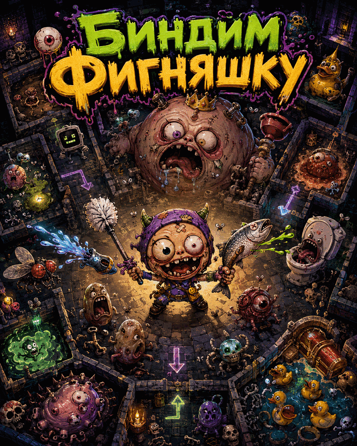

# Биндим Фигняшку — рогалик в духе The Binding of Isaac

Top-down рогалик: процедурный данжен из комнат, два режима боя (дальний/ближний),
враги, босс. Логика на чистом TypeScript, рендер — на **three.js** в **псевдо-3D**:
наклонная камера, пол лежит плашмя, персонажи — вертикальные спрайты-биллборды
(как в Isaac). Сборка — **Bun**.

<p align="center">
  
</p>

Есть **стартовое меню** с выбором уровня: данжен генерируется процедурно каждый
забег, но параметризуется набором правил (размер, плотность/сила врагов, HP, seed).
Двери видны всегда (закрыты в бою, открыты после зачистки). Графика — PNG-ассеты в
`src/assets/` (грузятся в `render/assets.ts`; при отсутствии файла — процедурный
фолбэк). Бриф на художку — `docs/ASSET_BRIEF.md`.

> Это рабочая **база для развития**, а не готовая игра. Архитектура специально
> сделана так, чтобы её было легко расширять — и человеку, и ИИ-агентам.
> Перед доработкой прочитай [`CLAUDE.md`](./CLAUDE.md) и [`docs/HOWTO.md`](./docs/HOWTO.md).

## Быстрый старт

```bash
bun install        # поставить зависимости (three, typescript)
bun run dev        # дев-сервер с авто-пересборкой → http://localhost:3000
```

Продакшн-сборка:

```bash
bun run build      # минифицированный бандл → dist/  (открой dist/index.html)
```

Проверки (запускай перед любым коммитом):

```bash
bun run typecheck  # tsc --noEmit, строгий режим
bun test           # юнит-тесты ядра
bun run check      # и то, и другое разом
```

## Управление

| Клавиша | Действие |
|---|---|
| WASD | движение |
| Стрелки | прицельная стрельба/удар в направлении |
| Пробел | атака по ходу движения |
| Tab / Q | сменить оружие (Дальний ↔ Ближний) |
| R | заново (на экране Game Over / Victory) |
| Esc | вернуться в меню выбора уровня |

Клавиши привязаны к **физическим** кнопкам (`event.code`), поэтому WASD/Q/R работают
в любой раскладке (в т.ч. русской), независимо от языка ввода.

Чтобы перейти в соседнюю комнату — зачисти текущую (двери откроются) и встань на
дверь, нажимая в её сторону.

## Режимы боя

| Режим | Оружие | Скорость | Урон | Особенность |
|---|---|---|---|---|
| Дальний | пистолет | быстро (cd 10) | 1 за выстрел | снаряды летят по прямой |
| Ближний | нож | медленно (cd 22) | 2 + отбрасывание | широкий взмах |

## Типы комнат

| Тип | Описание |
|---|---|
| spawn | старт, врагов нет |
| normal | 2–4 врага |
| treasure | без врагов (комната-награда), сразу открыта |
| boss | 1 босс; его зачистка = победа |

## Стек и устройство

- **Bun** — рантайм, бандлер и тест-раннер.
- **three.js** — WebGL-рендер мира в псевдо-3D (наклонная `PerspectiveCamera`, биллборд-спрайты).
- **TypeScript (strict)** — весь код.
- Архитектура: **логика игры полностью отделена от рендера**. Ядро (`src/core/`)
  не знает ни про DOM, ни про three.js, поэтому его легко тестировать и при
  желании можно подменить рендер, не трогая игру.

Подробности — в [`docs/ARCHITECTURE.md`](./docs/ARCHITECTURE.md).

## Структура проекта

```
src/
├── config.ts              ⭐ КОНСТАНТЫ движка: размеры, геометрия дверей, базовый баланс
├── main.ts                точка входа: меню → игра, «склейка» логики/рендера/ввода
├── core/                  ── ИГРОВАЯ ЛОГИКА (без DOM и three.js) ──
│   ├── Game.ts            «мозг»: состояние + один шаг симуляции step()
│   ├── rules.ts           ⭐ ПРАВИЛА УРОВНЯ (пресеты для меню: размер, враги, HP, seed)
│   ├── types.ts           общие типы (Dir, RoomType, Box, …)
│   ├── rng.ts             ГПСЧ с seed (детерминизм для тестов/отладки)
│   ├── util.ts            мат-утилиты (dist, overlap, clamp, lerp)
│   ├── entities/          Player, Enemy, Projectile, MeleeSwing
│   ├── world/             Room, RoomMap (генерация), tiles
│   └── systems/           collision, spawner (чистые функции)
├── input/                 ── ВВОД ──
│   ├── InputState.ts      абстрактные «намерения» (не сырые клавиши)
│   └── KeyboardController.ts  клавиатура → InputState
├── render/                ── РЕНДЕР (читает состояние, рисует) ──
│   ├── Renderer.ts        интерфейс рендера
│   ├── ThreeRenderer.ts   мир на three.js (псевдо-3D: наклон + биллборды)
│   ├── assets.ts          ⭐ АССЕТЫ (процедурные спрайты/текстуры → текстуры three.js)
│   ├── theme.ts           цвета/тинты мира (фон, эффекты)
│   └── HudOverlay.ts      HUD и миникарта на 2D-канвасе поверх
├── ui/
│   └── StartMenu.ts       стартовое меню (DOM) с выбором уровня
└── engine/
    └── GameLoop.ts        игровой цикл с фиксированным шагом (60 Гц)

tests/                     юнит-тесты ядра (bun test)
docs/ARCHITECTURE.md       архитектура и потоки данных
CLAUDE.md                  правила для ИИ-агентов и разработчика
docs/HOWTO.md              рецепты: как добавить врага/оружие/комнату
```
